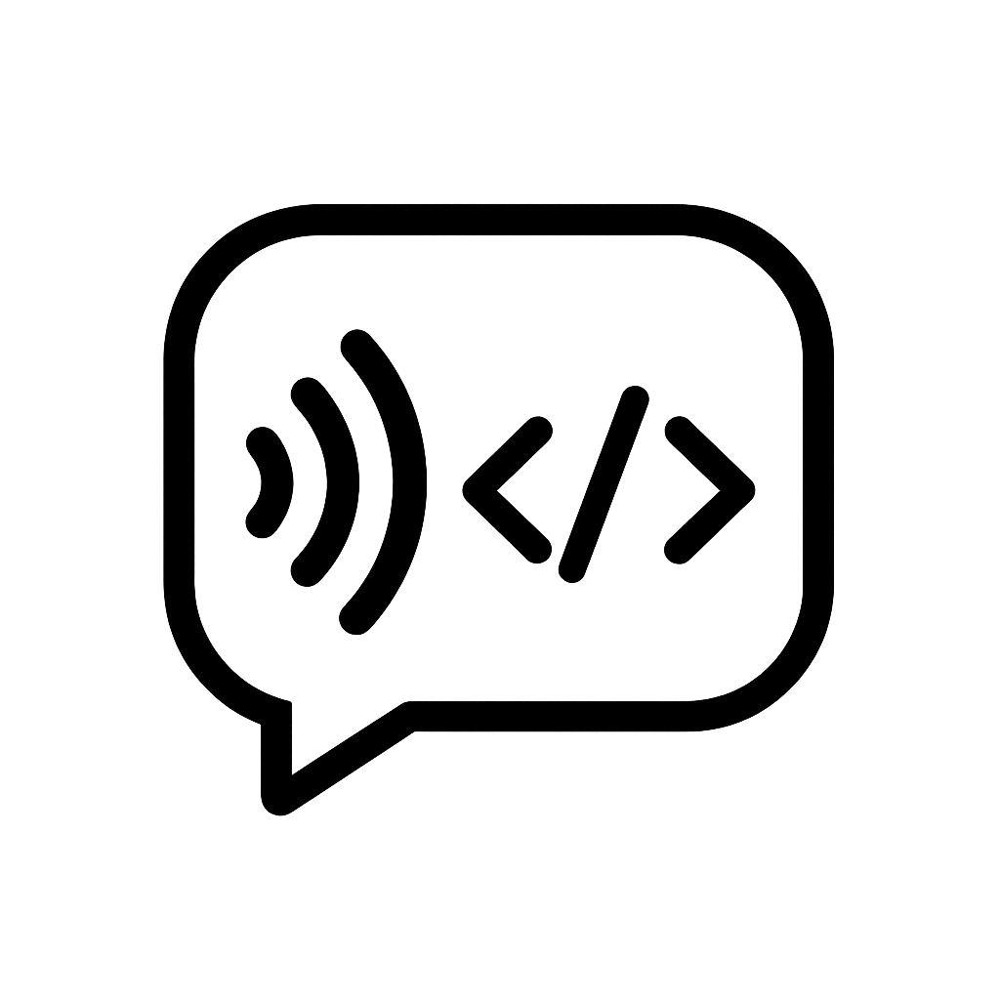

<p align="center">
  
</p>

# VibeWhisper

### A SuperWhisper Alternative

> **Note:** Currently, this application is primarily developed and tested for **macOS**. While it might run on Windows/Linux, full functionality (especially regarding permissions and pasting) is not guaranteed on those platforms yet.

A simple Electron application that runs in the background, listens for a global hotkey, records audio from the microphone, transcribes it using the **OpenAI Speech-to-Text API**, and pastes the resulting text into the active application.

## Motivation

This application was created out of a need for a reliable and free alternative to existing commercial dictation software, specifically the "SuperWhisper" application. The free tier of SuperWhisper was found to be quite slow, with transcription quality that wasn't ideal. Additionally, there were issues with the performance of its remote models. VibeWhisper aims to provide a fast, accurate (leveraging the OpenAI API), and seamless dictation experience without these limitations. (A version compatible with the Google Gemini API is also planned).

## Features

- **Background Operation:** Runs unobtrusively with a system tray icon.
- **Global Hotkey:** Activate/deactivate recording with a configurable key combination (Default: `CmdOrCtrl+Shift+Space`).
- **Cloud Transcription:** Uses the OpenAI API for potentially higher accuracy transcription (requires internet connection and API key).
- **Automatic Pasting:** Transcribed text is automatically typed into the currently focused input field.
- **Configurable Settings:**
  - Global hotkey customization.
  - Microphone input source selection.
  - OpenAI API Key input.
  - Estimated API usage cost tracking.
- **Styling:** Uses Tailwind CSS for the settings interface.

## Installation & Setup

1.  **Download the Installer:**
    - Go to the [**Releases Page**](https://github.com/barreiros/VibeWhisper/tree/develop/releases).
    - **For macOS:** Download the `.dmg` file.
    - For other operating systems: Download the appropriate installer (e.g., `.exe` for Windows, `.AppImage` or `.deb`/`.rpm` for Linux).
2.  **Run the Installer:**
    - Double-click the downloaded file and follow the on-screen instructions to install the application.
3.  **Configure OpenAI API Key:**
    - Launch VibeWhisper.
    - Open the **Settings** window (usually accessible from the system tray icon or the application menu).
    - Enter your OpenAI API key, which you can obtain from [https://platform.openai.com/api-keys](https://platform.openai.com/api-keys). The key will be stored securely locally.
4.  **Grant Permissions:**
    - **Microphone Access:** The application needs permission to access your microphone for recording. Your operating system (macOS or Windows) will prompt you for this the first time you try to record. Please grant access. You can check the status in System Settings > Privacy & Security > Microphone.
    - **Accessibility Access (macOS only):** On macOS, the application needs Accessibility permission to automatically paste the transcribed text. The application will prompt you for this on first launch. If pasting fails, ensure VibeWhisper is checked in System Settings > Privacy & Security > Accessibility.

## How to Use

1.  Launch the application after installation (e.g., from your Applications folder on macOS, or the Start Menu on Windows).
2.  If launching for the first time or the API key isn't set, open the Settings window (via the Tray icon or the Application Menu: File -> Settings / AppName -> Settings) and enter your OpenAI API key.
3.  A tray icon should appear. Right-click for Settings or Quit.
4.  (Optional) Configure the hotkey and microphone in the Settings window. Check the estimated API usage cost.
5.  Press the configured global hotkey to start recording (you might see console logs if running from the terminal).
6.  Speak clearly.
7.  Press the global hotkey again to stop recording.
8.  The application will send the audio to OpenAI for transcription, copy the result to your clipboard, and then attempt to paste the text into wherever your cursor is focused.

## TODO

- Improve error handling and user notifications (e.g., for API errors, network issues).
- Refine UI/UX for settings (further Tailwind styling).
- Add support for Google Gemini API as an alternative transcription service.
- Add support for selecting different transcription models (e.g., Whisper variants, Gemini models).

## Development Setup

If you want to contribute or run the application from the source code:

1.  **Prerequisites:**
    - Node.js and npm installed.
    - Git installed.
    - **Permissions:** Ensure you have granted Microphone and (on macOS) Accessibility permissions as described in the "Installation & Setup" section above.
2.  **Clone the Repository:**
    ```bash
    git clone https://github.com/barreiros/VibeWhisper # Replace with your actual repo URL
    cd vibewhisper
    ```
3.  **Install Dependencies:**
    ```bash
    npm install
    ```
4.  **Configure OpenAI API Key (Optional for Dev):**
    - You can create a `.env` file in the project root and add your key:
      ```
      OPENAI_API_KEY=your-api-key-here
      ```
    - Alternatively, set it in the Settings window after launching.
5.  **Run in Development Mode:**
    ```bash
    npm run dev
    ```
    - This starts the app with hot-reloading for code changes.
6.  **Build Installer Packages:**
    ```bash
    npm run build
    ```
    - This command uses `electron-builder` to package the application into distributable installers (e.g., `.dmg` for macOS, `.exe` for Windows) suitable for your current operating system.
    - The output files will be located in the `dist/` directory within the project folder.
